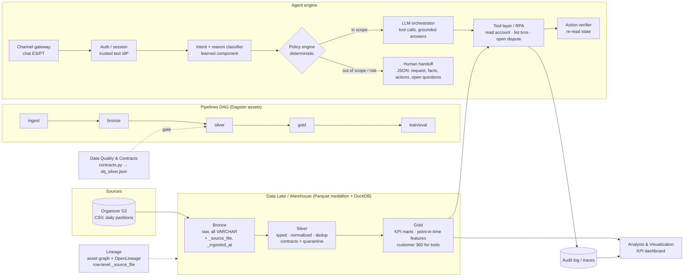

# IRIS — Plan, Data Findings and Target Architecture

Factored AI & Data Hackathon 2026 · LATAM Bank dataset (synthetic) · submission deadline **2026-10-05**

## 1. Goal and KPIs

Build an AI-first customer-service system for one focused banking workflow, measured on four IRIS KPIs:

| KPI | Definition (gold layer) | Current baseline (all data) |
|---|---|---|
| Customer satisfaction | mean CSAT (scale observed **1–4**), top-2 rate = score ≥ 3 | 2.77 · top-2 68.9 % |
| Cycle time | `wait_time_seconds + duration_seconds` (rows with known duration only) | 419 s mean |
| Interaction frequency | interactions per customer; repeat contact ≤ 7 days | 4.62 per customer · 3.7 % repeat ≤ 7 d |
| % Redirection | `was_escalated` rate | 10.0 % |
| (driver) FCR | `was_resolved` rate | 76.6 % |

KPIs by contact reason (686,296 interactions):

| contact_reason | n | CSAT | FCR | cycle (s) | redirection |
|---|---:|---:|---:|---:|---:|
| transactional | 240,056 | 2.91 | 91.5 % | 318 | 9.9 % |
| product | 150,863 | 2.90 | 89.6 % | 364 | 10.0 % |
| **complaint** | 117,021 | **2.43** | **43.6 %** | **533** | 10.0 % |
| technical | 102,899 | 2.70 | 69.9 % | 458 | 10.1 % |
| commercial | 54,879 | 2.66 | 65.2 % | 638 | 9.8 % |
| retention | 20,578 | 2.61 | 60.2 % | 578 | 9.8 % |

**Workflow prioritization:** complaints / transaction disputes are 17 % of volume but carry the worst CSAT,
the lowest FCR and the longest cycle time. Complaints table: top subcategories are *cargo no reconocido*
and *cobro indebido* (≈ 12k each), 20 % SLA breached. → Recommended workflow: **transaction-dispute intake**.

## 2. Variable relevance (model results)

`src/eris/model/feature_relevance.py` — LightGBM per KPI vs. an explainable baseline, temporal split
(train < 2025-07-01 ≤ valid < 2026-01-01 ≤ test), relevance by gain, mean |SHAP| and permutation
importance on the out-of-time test set. Full table: `reports/feature_importance.csv`.

| Target | Features | Baseline | Baseline score | LightGBM | Dominant variable (permutation) |
|---|---|---|---:|---:|---|
| CSAT top-2 | pre + in-contact | rate by `was_resolved` | AUC 0.789 | AUC 0.786 | `was_resolved` 0.218 (next < 0.002) |
| FCR | pre-contact | rate by `contact_reason` | AUC 0.764 | AUC 0.763 | `contact_reason` 0.257 (next 0.001) |
| Redirection | pre-contact | rate by `contact_reason` | AUC 0.501 | AUC 0.508 | none — label is noise |
| Cycle time | pre-contact | mean by `contact_reason` | MAE 84.5 s | MAE 84.0 s | `contact_reason` (92 % SHAP) |

What this means:

1. **CSAT is a function of resolution.** Resolved ≈ 3.0, unresolved ≈ 2.0, regardless of sentiment,
   escalation, channel or agent. The lever for satisfaction is FCR, not tone.
2. **FCR and cycle time are a function of the contact reason.** Customer profile, history, agent
   attributes and accent match add nothing measurable. Correctly identifying the reason is the job.
3. **Escalation is not learnable** from these labels (AUC 0.50). "When to hand off" must be a
   deterministic policy, not a model trained on historical `was_escalated`.
4. The gradient-boosted model does not beat a one-variable baseline. That is the honest result and it is
   reported as such: the data generator encodes simple rules.

## 3. Data quality findings (noise)

From `reports/dq_silver.json` and profiling:

| Finding | Impact | Handling |
|---|---|---|
| Fact-table row counts 11–16 % below the dictionary (interactions 686k vs 800k, transactions 4.43M vs 5M); digital_events 56 % above (15.6M vs 10M) | Dictionary is not authoritative | Contracts validate against observed data |
| No duplicate PKs or duplicate content in any table (dictionary claims ~2 %) | — | Dedup kept as a guard (newest wins) |
| Mixed Spanish/English categoricals (`Muy Negativo`, `Transaccional`, `México`, `Tarjeta Crédito`) | Breaks joins/grouping | Value maps to canonical codes |
| CSAT observed 1–4 (doc says 1–5); NPS 2–7 with no promoters | Scale misread | Scores analysed per `survey_type` |
| `customers.registration_branch_id` 99.99 % orphan; 831/1200 agents point to non-existent branches | Branch-level analysis invalid | `_orphan_*` flags, not dropped |
| `complaints.origin_interaction_id` 100 % null | Cannot link complaint ↔ call | Link by customer + time window |
| Transcripts: 546 distinct texts, 1 intent value, language always `es` | Weak NLP ground truth, **no Portuguese** | Synthetic PT test fixtures needed |
| `contact_reason` == `reason_category` | Redundant | Keep one |
| Nulls: duration 14 %, wait 30 %, accent 30 %, credit_score 15 %, income 20 % | Biased averages if coalesced to 0 | Treated as missing, never as 0 |
| Products: Mexican customers hold USD/COP/ARS products, no MXN | Currency logic unreliable | Use `amount_usd` for cross-country |
| Late arrivals: `process_date` = event date (lag 0) | None observed | Incremental re-ingest by object size |

## 4. Target architecture

### Service-by-service decisions

| Service | Choice | Why |
|---|---|---|
| **Pipelines DAG** | Dagster software-defined assets wrapping `bronze.py → silver.py → gold.py → feature_relevance.py` (today: plain scripts, same order) | Asset graph gives lineage + partitions for free; Airflow is heavier for a 10-day build |
| **Data Quality & Contracts** | Declarative contracts (`quality/contracts.py`): type, required, range, allowed set, value map → hard rules quarantine, soft rules null + count | Enforced outside the model; machine-readable DQ report per run |
| **Data Lake / Warehouse** | Parquet medallion on local disk / S3; DuckDB as query engine (MotherDuck or Databricks SQL in cloud) | 5 GB fits on one node; zero infra; same SQL scales to Databricks later |
| **Data Lineage** | Column `_source_file` + `_ingested_at` on every row, asset-level lineage via Dagster/OpenLineage | Any KPI can be traced to the source CSV partition |
| **RPA / Tool layer** | Deterministic mock banking API over gold tables: `get_account`, `list_transactions`, `open_dispute`, `get_dispute_status`; each action re-read to verify | "Report only verified actions"; permissions checked per customer session, not in the prompt |
| **Agent engine** | LLM orchestrator with tool calling, behind a **deterministic policy engine** (scope, confirmation, handoff rules) | Data shows escalation is not learnable → rules; CSAT depends on resolution → maximize correct resolution |
| **Learned component** | Contact-reason / intent classifier (ES + PT) evaluated vs. keyword baseline on held-out labeled set | Reason drives FCR and cycle time; this is where ML adds value |
| **Analysis / Visualization** | KPI dashboard on `gold/kpi_monthly.parquet` + agent audit log (Streamlit or Evidence) | Before/after comparison on the same held-out workload |

### Where AI vs. deterministic logic

- **Deterministic:** authentication, authorization per customer, eligibility/policy rules, handoff triggers
  (amount > threshold, fraud flag, repeated unresolved contact, unsupported request, low classifier
  confidence), action execution and verification.
- **AI:** understanding the request (intent + reason, ES/PT), clarifying ambiguity, composing grounded
  answers from tool results, building the handoff summary.

## 5. Plan (remaining work)

| # | Step | Output | Status |
|---|---|---|---|
| 1 | Ingest S3 incrementally with bounded retries | `data/raw` (7,671 files, 5.0 GB) | ✅ |
| 2 | Bronze Parquet + lineage columns | `data/bronze/*.parquet` | ✅ |
| 3 | Silver with contracts, quarantine, dedup, orphan flags | `data/silver`, `reports/dq_silver.json` | ✅ (8 core tables) |
| 4 | Gold: point-in-time features + KPI mart | `data/gold/*.parquet` | ✅ |
| 5 | Variable relevance per KPI vs baseline | `reports/model_results.json`, `feature_importance.csv` | ✅ |
| 6 | Silver contracts for `transactions`, `digital_events`, `campaign_sends`, rates, campaigns | all 13 tables in silver | ✅ |
| 6b | KPI catalog + scorecard aligned to IRIS flow | [KPIS.md](KPIS.md) | ✅ |
| 7 | Labeled eval set for dispute intake (ES + synthetic PT; normal, ambiguous, human-required, injection, unauthorized) | `eval/cases.jsonl` (50 cases), `eval/intents/` (378 utterances) | ✅ |
| 8 | Intent/reason classifier vs keyword baseline | `models/intent_metrics.json`, [EVALUATION.md](EVALUATION.md) | ✅ |
| 9 | Agent: policy engine + tools + LLM + handoff JSON | `src/iris_bot`, [BOT_DESIGN.md](BOT_DESIGN.md) | ✅ |
| 10 | Evaluation: safe automated resolution, containment, escalation quality, unsafe outcomes, p50/p95 latency, cost | [EVALUATION.md](EVALUATION.md) (offline, MockLLM) | ✅ |
| 11 | Deploy + 4–6 slides + video | submission | ⏳ |

## 6. Limitations

- Data is synthetic; relationships are rule-like, so model gains over baselines are not expected.
- No Portuguese data at all; PT coverage must be demonstrated with labeled synthetic fixtures.
- Survey scales differ from the dictionary; CSAT conclusions use the observed 1–4 scale.
- All results are offline measurements, not production improvements.
