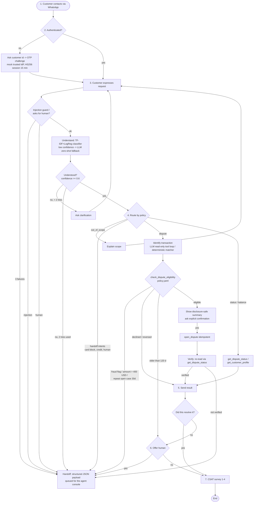

# IRIS Bot — Design

Package: `src/iris_bot/`. Entry point: `iris_bot.api.app:app`. Composition root: `iris_bot.runtime.build_runtime`.

## 1. Flow (mirrors the IRIS diagram)



## 2. State machine

| State | Waits for | Transitions |
|---|---|---|
| `START` | first message | stores the request as pending → `AWAIT_CUSTOMER_ID` |
| `AWAIT_CUSTOMER_ID` | `CLI-…` id | → `AWAIT_OTP`; 3 bad ids → `HANDED_OFF` (`auth_failed`) |
| `AWAIT_OTP` | 6-digit OTP | ok → resume the earlier stage, or process the pending request; 3 failures → `HANDED_OFF` |
| `AWAIT_REQUEST` / `AWAIT_CLARIFICATION` | free text | classify → route; ≤ 2 clarifications, then `not_understood` handoff |
| `AWAIT_TXN_SELECTION` | number / merchant / amount | → eligibility; 2 failed attempts → `no_matching_transaction` handoff |
| `AWAIT_CONFIRM` | yes / no | yes → open + verify → `AWAIT_FEEDBACK`; no → `AWAIT_REQUEST` |
| `AWAIT_FEEDBACK` | yes / no / new request | yes → `AWAIT_CSAT`; no → `AWAIT_HANDOFF_OFFER` |
| `AWAIT_HANDOFF_OFFER` | yes / no | yes → `HANDED_OFF`; no → `AWAIT_CSAT` |
| `AWAIT_CSAT` | 1–4 | → `CLOSED` (asks at most twice) |
| `CLOSED`, `HANDED_OFF` | — | terminal; the next message starts a new case |

Cross-cutting checks run on every turn: the injection guard, an explicit request for a human, and session validity. An expired session re-authenticates and then **resumes the same stage**. No action runs on an expired session.

## 3. Policy (`config/policy.yaml`, enforced in code)

| Rule | Value | Effect |
|---|---|---|
| Max automated dispute amount | 400 USD (`amount_usd`) | above → `amount_over_threshold` handoff; an unknown USD amount is treated as above |
| Max transaction age | 120 days from the bank "as-of" date (latest data timestamp, 2026-06-18) | older → explained, offer human |
| Allowed statuses | Approved, Pending | Declined → "nothing was charged"; Reversed → "already refunded" |
| Disputable types | Purchase, Payment, Withdrawal, Adjustment | others → `unsupported_intent` handoff |
| Fraud flag | `is_fraud` or `fraud_score >= 30` | `fraud_flag` handoff (priority high) |
| Repeat contact | ≥ 1 open same-reason case in 30 days | `repeated_unresolved_reason` handoff |
| Clarification turns | max 2 | then `not_understood` handoff |
| Classifier confidence | min 0.6 | below → LLM fallback, then clarification |
| OTP attempts | max 3 | then `auth_failed` handoff |
| Session TTL | 15 min | expired → re-auth and resume |
| Tool / LLM retries | 3 attempts, exponential backoff 0.2 s → 2 s | after that → `tool_failure` handoff |

The handoff triggers are: `fraud_flag`, `amount_over_threshold`, `customer_requested_human`, `repeated_unresolved_reason`, `unsupported_intent`, `prompt_injection`, `tool_failure`, `not_understood`, `result_insufficient`, `auth_failed`, `no_matching_transaction`.

## 4. What is AI and what is deterministic

| Concern | Implementation |
|---|---|
| Authentication, session expiry, permissions | Deterministic (IdP + tool-layer scoping) |
| Intent understanding | **Learned** TF-IDF + LogReg; **LLM** (DeepSeek Flash) zero-shot only when confidence < 0.6 |
| Which transaction the customer means | **LLM** (DeepSeek V4 Pro) read-only tool loop (`list_recent_transactions`, `get_transaction`, `select_transactions`); deterministic matcher as fallback and in baseline mode |
| Eligibility, handoff triggers | Deterministic policy |
| What is disclosed | Deterministic disclosure filter (`public_transaction`, `render_txn`) |
| Write actions (`open_dispute`, `handoff_to_human`) | Deterministic, only after explicit confirmation; **never exposed to the LLM** |
| Verification | Deterministic re-read before reporting |
| Reply text | Fixed templates in ES / PT-BR (`i18n.py`), so the bot can't make up an amount or a case id |
| Handoff summary | **LLM** (DeepSeek Flash) with an output guard; deterministic template as fallback |

## 5. Tool data contracts (`src/iris_bot/tools/banking.py`)

Every tool runs through `ToolRuntime.run`. That step validates the session, applies bounded retries, honors fault injection, sanitizes the output and writes an audit row. No tool accepts `customer_id`; the customer always comes from the session.

| Tool | Input | Output | Errors |
|---|---|---|---|
| `get_customer_profile` | — | `{country, segment, status, products:[{product_last4, product_type, currency, status, balance, credit_limit}]}` | `customer_not_found` |
| `list_recent_transactions` | `days ≤ 180`, `disputable_only`, `limit` | `[PublicTxn]` | — |
| `get_transaction` | `transaction_id` | `PublicTxn` | `PermissionDenied` (other customer), `transaction_not_found` |
| `check_dispute_eligibility` | `transaction_id`, `reason ∈ {unrecognized_charge, wrong_fee}` | `{eligible, reason_code, handoff_trigger, existing_dispute_ids, prior_open_same_reason, checks}` | `PermissionDenied` |
| `open_dispute` | `transaction_id`, `reason`, `idempotency_key`, `customer_confirmed=true` | dispute row `{dispute_id, status: "opened", …}` (re-checks policy inside) | `customer_confirmation_required`, `not_eligible:<code>`, `PermissionDenied` |
| `get_dispute_status` | optional `dispute_id` | `{disputes:[…], complaints:[…last 180 d, dispute subcategories]}` | `PermissionDenied`, `dispute_not_found` |
| `handoff_to_human` | `HandoffPayload` | `{handoff_id, verified}` (re-read) | — |

`PublicTxn` = `{transaction_id, date, merchant, type, amount, currency, amount_usd, status, product_last4}`. It never includes `fraud_score`, `is_fraud`, `customer_id`, the full `product_id` or `response_code`.

## 6. Handoff payload (`HandoffPayload`, `agent/models.py`)

```json
{
  "handoff_id": "HO-…", "created_at": "…", "conversation_id": "…", "case_id": "…", "channel": "whatsapp",
  "customer_id": "CLI-…", "authenticated": true, "language": "es",
  "trigger": "fraud_flag", "reason": "posible fraude…", "priority": "high",
  "intent": "dispute_unrecognized_charge", "intent_confidence": 0.81,
  "request_summary": "Customer (es) … Transaction under review: TRX-…",
  "verified_facts": [{"key": "disputed_transaction", "value": {…}, "source": "get_transaction", "evidence_id": "TRX-…"},
                     {"key": "eligibility", "value": {"eligible": false, "reason_code": "fraud_flag", …}, …}],
  "actions_taken": [{"action": "open_dispute", "status": "verified|not_verified|failed|denied|cancelled", "reference_id": "DSP-…"}],
  "evidence_ids": ["TRX-…"], "open_questions": ["Transaction carries a fraud flag: …"],
  "transcript": [{"role": "customer", "text": "… OTP redacted as ******"}], "trace_id": "…"
}
```

## 7. Observability

- `audit_log` rows have these steps: `turn` (latency, tokens, cost, stage), `tool` (latency, attempts, outcome `ok | error | tool_failure | unauthorized_access_attempt`, redactions), `understand`, `auth`, `guard`, `permission`, `error`.
- structlog writes one JSON line per turn with `trace_id`.
- `GET /metrics` reports these proxies, with their definitions: FCR (feedback = yes), containment, handoff rate, missed-escalation proxy (said "not solved" and no handoff), unnecessary-escalation proxy (handoffs for `not_understood`), p50/p95 latency, cost per case, CSAT.
